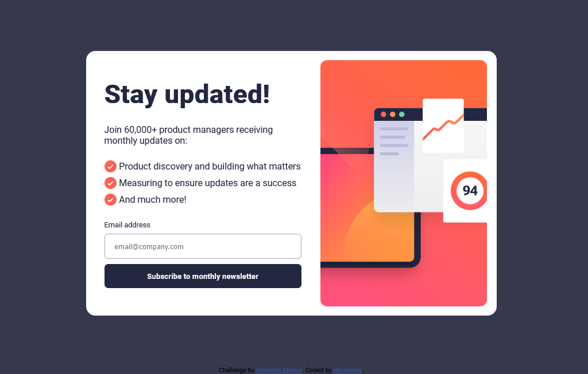

# Frontend Mentor - Newsletter sign-up form with success message solution

This is a solution to the [Newsletter sign-up form with success message challenge on Frontend Mentor](https://www.frontendmentor.io/challenges/newsletter-signup-form-with-success-message-3FC1AZbNrv). Frontend Mentor challenges help you improve your coding skills by building realistic projects.

## Table of contents

- [Overview](#overview)
  - [The challenge](#the-challenge)
  - [Screenshot](#screenshot)
  - [Links](#links)
- [My process](#my-process)
  - [Built with](#built-with)
  - [What I learned](#what-i-learned)
  - [Continued development](#continued-development)
  - [Useful resources](#useful-resources)
- [Author](#author)
- [Acknowledgments](#acknowledgments)

## Overview

### The challenge

Users should be able to:

- Add their email and submit the form
- See a success message with their email after successfully submitting the form
- See form validation messages if:
  - The field is left empty
  - The email address is not formatted correctly
- View the optimal layout for the interface depending on their device's screen size
- See hover and focus states for all interactive elements on the page

### Screenshot

### Links

- Solution URL: [Github Repo](https://github.com/HectorKayman/newsletter-sign-up)
- Live Site URL: [Github Pages](https://hectorkayman.github.io/newsletter-sign-up/)

## My Process

### Built with

- Semantic HTML5 markup
- CSS3
- Flexbox
- Vanilla JavaScript
- Mobile-first workflow

### What I learned

This was my first challenge on Frontend Mentor, HTML and JavaScript were fairly easy, CSS took the most time to figure out correctly, will have to come back to it at some point, as I feel that it is very cluttered.

### Continued development

Need to increase my understanding of Flexbox and media query more. Gotta learn a good CSS framework, to save time.

### Useful resources

- [Flexbox Froggy](https://flexboxfroggy.com/) - This helped me in understanding flexbox. I really liked the gamification of learning.

## Author

- Website - [Himanshu Kaushik](https://www.your-site.com)
- Frontend Mentor - [@HectorKayman](https://www.frontendmentor.io/profile/HectorKayman)

## Acknowledgments

- Kevin Powell on YouTube is always very helpful with his videos.
- Jonas Schmedtman's JavaScript Mastery course has helped me a lot in understanding hte workings of JS.
